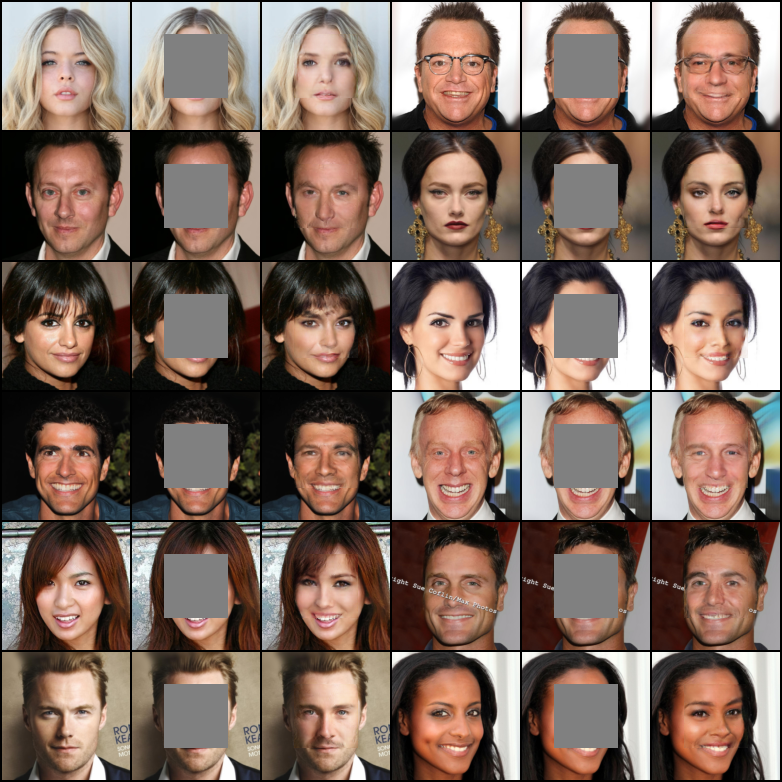
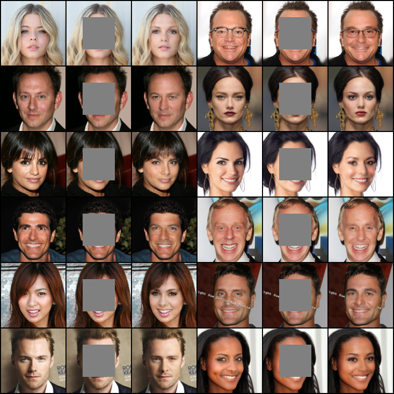

# Context-Encoder-pytorch

> Pathak, Deepak, Philipp Krahenbuhl, Jeff Donahue, Trevor Darrell, and Alexei A. Efros. "Context encoders: Feature learning by inpainting." In Proceedings of the IEEE conference on computer vision and pattern recognition, pp. 2536-2544. 2016.

Unofficial implementation of Context-Encoder.

<br/>


## Installation

Clone this repo:

```shell
git clone https://github.com/xyfJASON/Context-Encoder-pytorch.git
cd Context-Encoder-pytorch
```

Create and activate a conda environment:

```shell
conda create -n context-encoder python=3.9
conda activate context-encoder
```

Install dependencies:

```shell
pip install -r requirements.txt
```

<br/>


## Training

```shell
accelerate-launch train.py [-c CONFIG] [-e EXP_DIR] [--xxx.yyy zzz ...]
```

- This repo uses the [🤗 Accelerate](https://huggingface.co/docs/accelerate/index) library for multi-GPUs/fp16 supports. Please read the [documentation](https://huggingface.co/docs/accelerate/basic_tutorials/launch#using-accelerate-launch) on how to launch the scripts on different platforms.
- Results (logs, checkpoints, tensorboard, etc.) of each run will be saved to `EXP_DIR`. If `EXP_DIR` is not specified, they will be saved to `runs/exp-{current time}/`.
- To modify some configuration items without creating a new configuration file, you can pass `--key value` pairs to the script.

For example, to train the model on CelebA-HQ:

```shell
accelerate-launch train.py -c ./configs/celebahq.yaml
```

To do ablation study on the effect of adversarial loss:

```shell
accelerate-launch train.py -c ./configs/celebahq.yaml --train.coef_adv 0.0
```

<br/>


## Evaluation

```shell
accelerate-launch evaluate.py -c CONFIG \
                              --model_path MODEL_PATH \
                              [--n_eval N_EVAL] \
                              [--micro_batch MICRO_BATCH]
```

- This repo uses the [🤗 Accelerate](https://huggingface.co/docs/accelerate/index) library for multi-GPUs/fp16 supports. Please read the [documentation](https://huggingface.co/docs/accelerate/basic_tutorials/launch#using-accelerate-launch) on how to launch the scripts on different platforms.
- You can adjust the batch size on each device by `--micro_batch MICRO_BATCH`.
- The metrics include L1 Error, PSNR and SSIM, all of which are evaluated only in the 64x64 central area.

<br/>


## Sampling

```shell
accelerate-launch sample.py -c CONFIG \
                            --model_path MODEL_PATH \
                            --n_samples N_SAMPLES \
                            --save_dir SAVE_DIR \
                            [--micro_batch MICRO_BATCH]
```

- This repo uses the [🤗 Accelerate](https://huggingface.co/docs/accelerate/index) library for multi-GPUs/fp16 supports. Please read the [documentation](https://huggingface.co/docs/accelerate/basic_tutorials/launch#using-accelerate-launch) on how to launch the scripts on different platforms.
- You can adjust the batch size on each device by `--micro_batch MICRO_BATCH`. The sampling speed depends on your system and larger batch size doesn't necessarily result in faster sampling.

<br/>


## Results


### CelebA-HQ

**Quantitative results**:

<table align="center" width=100%/>
  <tr>
    <th align="center">Loss</th>
    <th align="center">L1 Error</th>
    <th align="center">PSNR</th>
    <th align="center">SSIM</th>
  </tr>
  <tr>
    <td align="center">L2 + Adv</td>
    <td align="center">0.0720</td>
    <td align="center">20.3027</td>
    <td align="center">0.5915</td>
  </tr>
  <tr>
    <td align="center">L2 only</td>
    <td align="center">0.0694</td>
    <td align="center">20.5573</td>
    <td align="center">0.6153</td>
  </tr>
</table>

**Selected samples**:

<table align="center" width=100%/>
  <tr>
    <th align="center">L2 + Adv</th>
    <th align="center">L2 only</th>
  </tr>
  <tr>
    <td align="center"></td>
    <td align="center"></td>
  </tr>
</table>
Though "L2 only" got better PSNR and SSIM score, it is visually more blurry than  "L2 + Adv".

